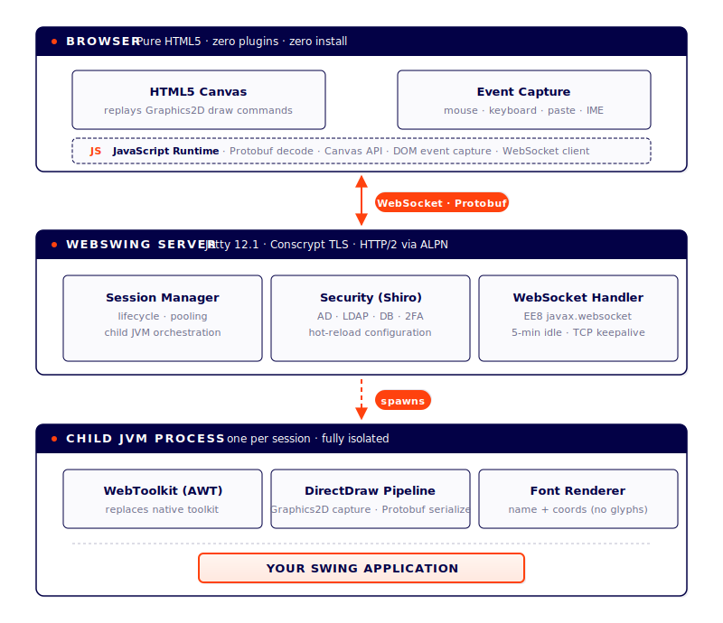

<div align="center">

# WebSwing Lite 26.4.3

### Enterprise Java Swing Applications — Delivered Through Your Browser

[](https://github.com/manticore-projects/webswing/actions/workflows/Gradle.yml)
[](https://github.com/manticore-projects/webswing/releases)
[](https://openjdk.org/)
[](https://nodejs.org/)
[](https://www.gnu.org/licenses/agpl-3.0)
[](https://gradle.org/)
[](https://github.com/manticore-projects/webswing)

<br/>

*Run any Java Swing application inside a modern web browser — pure HTML5, zero plugins, zero client-side installation.*

<br/>

[Getting Started](#-getting-started) · [Build](#-build-instructions) · [What's New](#-whats-new) · [Architecture](#-architecture)

---

</div>

## Overview

**WebSwing Lite** is a modernized, open-source edition of [WebSwing](https://www.webswing.org) — the web server that renders Java Swing applications in HTML5 Canvas and delivers them to any browser via WebSocket.

This edition is based on the **last open-source release (v20.2.5)** of WebSwing, updated and maintained by [Manticore Projects](https://manticore-projects.com) with a focus on **modern JDK compatibility**, **security**, and **build toolchain modernization**.

> **Looking for the full-featured commercial edition?**
> WebSwing Lite does not include advanced capabilities such as cluster session pooling, load balancing, recording/playback, advanced admin console, and commercial support.
> For production deployments at scale, we encourage you to explore the [**Commercial Edition at webswing.org**](https://www.webswing.org) →

---

## What's New

### JDK Compatibility

Recommended standard OpenJDK distributions: [Eclipse Temurin](https://adoptium.net/), [BellSoft Liberica](https://bell-sw.com/pages/downloads/), or [Amazon Corretto](https://aws.amazon.com/corretto/).

| JDK |    Status    | Temurin Support | Notes                                                     |
|:---:|:------------:|:---------------:|:----------------------------------------------------------|
| 17 (LTS) | 🔶 Supported | Oct 2027 | Toolchain of the build                                    |
| 21 (LTS) | ✅ Supported  | Dec 2029 |                                       |
| 23 | ✅ Supported  | ⛔ EOL (Mar 2025) | Non-LTS, 6-month lifecycle                                |
| 25 (LTS) | ✅ Supported  | Sep 2031 | Current LTS                                               |
| 26 | ✅ Supported  | Sep 2026 | Non-LTS; requires `--sun-misc-unsafe-memory-access=allow` |

All internal APIs adapted for the post-JDK-11 module system — no `--illegal-access=permit`, no `-noverify` required.

**Beware:** JetBrains Runtime modifies AWT's internal keyboard focus dispatch, which breaks when Webswing replaces the toolkit. Mouse events are unaffected because they bypass the patched focus path.

### Demo

Try the [Online JSQLFormatter using Webswing Lite](http://jsqlformatter.manticore-projects.com/jsqlformatter/demo.html?args=-c%20OoSQKgEgBApgHlAggZSgCgFBWz7yCiAMvgMJhQBUWuOAYgEoDyAslAMYBmMAdAE4wAHAPrwoASmrYANFA5xeSVJho4CxMtgCWAEyFsArr34A7NgE8hHXgHsAtpJWOZc3gEMALjAe4GLdndtrY24XDxghAAsAZ3dvHGAIfHp8dCgdPUMTc0sbWxl0gyMYUwtNY3drGQA3VwAbfXDtMPEoEAA5VLwiUnI03UKsiys7OMcx8YnJqencfP7M4uyyitGZtfWNyZlmVzg0WXluGvrG5rEoY4ahJs9VzfuHx19WNgCgkPkwyJiD3jvHgGA1ptNpJKAAKUY7XYXD4ghECHg-yBKMejA6LiOdSuNxgUAAPABeWBwLEna5hZGo6ljADiTAAqgAFKAAIQAmrgCgsSjkRjSBdS5hkirzltZxFTEG0ACJ9EWDITiqDEgBcrMYjAA0kISAz6Mk2iR2asGW0QOikIRCKs1D1sOrNTq9Qb8EaTesZABGVbPKDafR1SWzfy1WpCdxmAQwKKKdC27oaAD0FAA1FAZfQQAA1dq0oTIcD4NCIc4UJNUqhjP2vWyBYKvMNhNzhyPRqCuKntUH0CFQjr7VSJ8g7Pbyxu1Zt1CNR8L8DgtArWJueFsz6NCedU9Y1t4N5eT1fTtteGkJJIpdIxDz6WPQ-YAchID5kD4gD+D1PpjGZbM5S5XGA1xPT9NgZQs2lpVIAMPIDj1nTcYAXc4JDtDRQ1qbgl30cogIEVxeEjVYZDYARuFeHDV3wwiLG0GM2GIjCsP6A8p1qRiJ2YvRWKPVtZygAAfASoA-NAIBIVURME4SwGsXUIgI-YJ3XGNuAUzReAydxKCgL0AAY9NfABOEzuAMj8JGmISRIAUnED8YLYlSOIPcieLg8M6KiBixhkVwBAEXguInNjx3ctd-MC1xNCiOpGMioL0gS6LYvDLdfI7AKgsuID4qyskcWaZKYunXE8sCgrTluaZ02Uk8ojhS4PE0IIhGjXgWu0C46nSSjNHYjKErhABzGLVxgXQcvKoKOGizSpoykhrDqeiYH2IbZo0oQcpkPTQImChfg+NxPFkObtuxcIACMfKcTKKo4axeDYCahFS8IFruoaomKFrNLoq73Ciabgp5cwQbKKJDFywb8shwxXFMcJXECSiIfmUUlmMKG3CRiHsYRpGEQEDTaMpDL9jQ8hkH0Wx1u4FGnvcGLXteGJrg0yMhBu-bqyYF5YX4YQODKIRXCiH6ge4sMO23HBuzBSFoU4HhIfcXhaeKdxpdglsoCuuWVEtVwuLVjXbC1lV9dN7H1c18oqXPZJrcc3irc412PJaK7rGsABrC7yRuxjKeHKAabpjsGdR8odMxUJTssyY-SRdYFd7JWOhVrDbc05T+FeKogIsaJtM7B5LXgSqKVO4kTeOdIyrTkFFf7GEeBC3jEIXA2K46E3PbXecrau4LwundLAWlOVR8HoNiQ9ljAJbQ3gR7PtoRcVfcGN0HMbMK3MW5fe+VsFo6lqaw2DCJfdenHLudulQZFD9RyEIMbXGG4b6fSM37e0tZD8L4oAkAiLwfY+kWjWTARA3SABmFoScASgEgNCb8v40CMHoDKMEHIo5-1zgA5B4wayC3hCLYwYsJYwClhOWWzd16Z3bjnGI5stY61Cr3e4u9CFsIASPG2-CLYOymE7FIJtGaERZixdm2hOYHwAITEj0mZPSq9p4u1vqFBerk561BaCgKAP1CivXFpLYGi0UD4EdokDo+AAAaIBkBgCUEON+ult7J35iw-+Ijtady9uXQUa9W7K3IcLUW5jaFRB1vrLxmxeG6D8ZbYks9klEP8Qkx4miB7aLdrosMY9l5xTPIkZ26SFSLCUWqDU2pdT6kNMaXmkxIBuhEuyB8VIiAEBEm0LpUw3RyhMdDWJchqEWMYiQaxtj2mOOca4zo4cw4+hpGQ1WmSOGBL1sEwU6cN5ZwiZYKJNC6EHniSEmgSSlSbNjmkoRdssmXLGLk4pd8DGFMwvo7JYxxFaO4pRPCBFIxQGUUxbCuFeDURBSQqYbSOgPk6d0wgvSHz9O6bKYxMBTGxPgbwXQ0LNAximTMsRdj7rZUujXPEzioBtAZNaVe8KRLtBICwJkxAwD4AGZMc8-d8oP1xFAWqB4VINX4E1ZmrV2qdQJCSauTc1jMofI4pkIBkgyh5RMHpKR6WMsGZi687hbwYBTnABwL9lkeJTOmTMOY8wFiLCWMsFYph5M4V3SeExhTbNKVsMKJS+LRipDIWS8lFL+noh1AQUrjAtF9Z5eiIawqAqhcCswyarzuBvJY-1vUfqaQmpoCofwpgyH0AIXEEZNAW2vLYAQvofEdSiH7NygaGGTH2cwwcXQPGjn2Po7ui58keW7j8p4TaYqtoTeOlQfys05uBKkJ8IC3wWVnTQDBLJ8H6JaTMcCeZoIjqHkhPdUAzQWg6IgfVjgqZQBtRmLMuZIKOq5c6ygrrJjuoTWOstBDj1+u9f+j1o6TzJrDWAiNJsvJsGjbG+N49E3eWTd+6wqboUZr-e6o1JqsNcVvEBEQ8iS0oe4BWqtzNa3ZvrY2vwzbp2IY7RMLtbce1WvtP2gN7yh3nEHV6lEfp6NtveRu3A87dA4bvAOESiBV2arPQ8Ldf4uOhVhWsA9kEj0gZPchKkxBaDkGYUJhNFy1jXJM-c75DxNGVMk0ux8z5XzvjPX8ypP7h60r1YQBDYYHD6cM6x9jyY0yPvtS+wsb7SwfuyRCqi6bsmhrkpBuBMG4MtTjecCikKMPXCTTuSdLa3LofTUxjYLH7y4DvZx2LQKaI8ZTdl9Nv7nnYEE1OorjWaKid5eUy8Ens3Gqk8uxzIlnNqcFEpndLFis0QU-cDTUEB3Tc61zYeKF2ANrGJaReAKVsHwXmRGraauu4H8wc1IPa70Prtc+-MEXixRfLButziGN1+S4sVVKzWASJfDXAnKChzgA7e1HQV5NAQyH4KNGIQFXqfR+2dLa8PHjOCei9CTK1A4NBBz9Ywf1cuA1zQj4+gwQcQYUnA+G-BAdpAJtTkHVPEYvTFjHWIQIfVg1KHTpnp4Ie05xjz4mpNqXZLa4Vz7QZdmPHKx0YzjHuGonM4hodlmANpSQhumXSygu9Be4G7rCPOP1ypUK84thdhY6qrzlrPgCutolwYqXNuaBa7l+2hXzvxhK8DSr-57mNee-iL14DdmKsrqc+uwP2BJucj1+8+NBuoCWjjzo9gby2KJ9wK8sHtc0-m7gJbkXQItdsbvfrL06feKZ-uH5CvOfrdR+flAarugHf1aSllFKE8A9R7F-bzvJVHerMb-LFuGc25u-j1dYfI+rn9wr3x09aSF9q++57v5rgV9vQG7eezIkRtrrmy1mzW-Q-SfD6NyPUeY+4Gn5Xjy1eEeb4VWcf0ifLTaHv3rVX2nAMCk0Z-vXu7NwPnoXoqoKAAR9gPl9sPHXFAVFIPmvusBvlxGfsNqumNufFlNklrlvECMbHDBjIMIfIcCTtUqfGettnomrlbENFZjgGdswnVLOETnPuCqviBJ8mKl-vBMGgANxAA$$) 


### Features

- **Truly headless operation on Linux** — no X server, no Xvfb, no virtual framebuffer. AWT initialises against an `--patch-module`–injected `GraphicsEnvironment` + `FontManagerFactory` that bypass `libawt_xawt.so` entirely. A `*-jre-headless` JDK package is sufficient; container images shrink accordingly.
- **Shiro Security Plugin** with hot configuration reloading provides authorization via AD/LDAP/Database/Text Files with or without 2FA (Second Factory authorization)
- **SVG Application Icons**
- better server start scripts supporting SSL certificate registration and WAR version numbers
- Deduplication of the java libraries in the WAR file, reducing the size drastically
- **Network resilience** for flaky corporate VPNs (Netskope, Zscaler) — HTTP/2 via ALPN, Conscrypt TLS (tolerates underscored SNI hostnames), per-socket TCP keepalive, 5-minute idle timeouts, TLS session resumption, tuned thread pool with `LowResourceMonitor`

### Build & Runtime Modernization

- **Node.js 24 LTS** — migrated from Node 10; Webpack 5, TypeScript 5, Dart Sass
- **Gradle build system** — fast, incremental builds
- **All dependencies updated** — Jetty12, Jackson3, Guava, Log4j2, SLF4J 2.0, Apache Commons, Protocol Buffers, LZ4, and more

### Performance

- **SSE/AVX-optimized PNG encoding** via [zpng-java](https://manticore-projects.com/FPNG-Java/index.html) — hardware-accelerated image compression in the DirectDraw rendering pipeline
- **Browser-side font rendering** — text is rendered as font names + coordinates instead of server-side glyph bitmaps, reducing WebSocket bandwidth by up to 80%
- **GZIP/Brotli pre-compression** for all static assets (reducing the JS size from 5 MB to less than 1 MB), GZIP compression for all content (JSON)

### Security

This fork implements defence-in-depth for deployment at regulated financial institutions.

[](https://snyk.io/test/github/manticore-projects/webswing)
[](https://github.com/manticore-projects/webswing/actions/workflows/semgrep.yml)
[](https://semgrep.dev)
[](https://app.codacy.com/gh/manticore-projects/webswing/dashboard?utm_source=gh&utm_medium=referral&utm_content=&utm_campaign=Badge_grade)

**Continuous monitoring** via Snyk (dependency CVEs), Semgrep (SAST/OWASP Top 10), SpotBugs (bytecode analysis), and Codacy (code quality). CycloneDX SBOM generated with every release.

**Proactive hardening** against entire vulnerability classes — not just known CVEs: deserialization allowlists (CWE-502), SSRF scheme validation (CWE-918), XSS content-type enforcement (CWE-79), Zip Slip / path traversal protection (CWE-22), log injection sanitisation (CWE-117), AES-CBC→AES-GCM migration, and HMAC-signed file identifiers.

**Runtime** — non-root Docker container on Eclipse Temurin JRE 21 (Ubuntu Noble), multi-stage build excluding source and build tools from the image.

**Compliance alignment** — tooling and controls support evidence gathering for DORA, SOC 2, ISO 27001, CBN IT Standards, NIST SSDF, and PCI DSS v4.0. SBOM output satisfies supply chain transparency requirements under NIST SP 800-218 and the EU Cyber Resilience Act.

---

## Getting Started

### Prerequisites

| Component | Version |
|-----------|---------|
| JDK | 17 or later (21+ recommended; [Eclipse Temurin](https://adoptium.net/)). A **headless** JDK distribution is sufficient on Linux servers — see below. |

**No X server, no Xvfb, no virtual framebuffer required.** Webswing Lite 26.4.3 runs truly headless on Linux via `--patch-module java.desktop` replacements for `GraphicsEnvironment`, `PlatformGraphicsInfo`, and `FontManagerFactory`. The standard `*-jre-headless` package from your distribution (or any JRE/JDK without the GUI dependencies) is enough. `DISPLAY` is explicitly unset by the startup script; nothing in the child Swing JVM ever calls into `libawt_xawt.so` or attempts a display connection.

### Quick Start

```bash
# Download the latest release
curl -LO https://github.com/manticore-projects/webswing/releases/latest/download/webswing-26.4.3.zip
unzip webswing-26.4.3.zip
cd webswing-26.4.3

# Start the server
./run.sh start

# Open in your browser
open http://localhost:8080
```

### Management

```bash
./run.sh start      # Start the server (background, with log tailing)
./run.sh stop       # Graceful shutdown (30s timeout, then SIGKILL)
./run.sh restart    # Stop + Start
./run.sh status     # Check if the server is running
```

---

## Build Instructions

### Prerequisites

| Tool   | Version |
|--------|---------|
| JDK    | 21+     |
| Gradle | 8.12    |
| Git    | 2.x     |

> Node.js and npm are **automatically downloaded** during the build — no manual installation needed.

### Build with Gradle

```bash
# Clone the repository
git clone https://github.com/manticore-projects/webswing.git
cd webswing

# Full build
./gradlew clean build

# Build specific modules
./gradlew :webswing-directdraw:webswing-directdraw-javascript:build
./gradlew :webswing-server:webswing-server-frontend:build
```

### Deploy

```bash
# Extract to your deployment directory
unzip build/dist/webswing-26.4.3.zip -d /opt/webswing

# Configure your Swing application in webswing.config
vim /opt/webswing/webswing.config

# Start
cd /opt/webswing && ./run.sh start
```

---

## Architecture

<p align="center">
  
</p>

**How it works:** The server intercepts Java2D `Graphics2D` paint operations in the child JVM, serializes them via Protocol Buffers, and streams them over WebSocket to the browser. The browser's JavaScript engine deserializes and replays the draw commands on an HTML5 Canvas. User input (mouse, keyboard) flows back over the same WebSocket.

---

## Dependency Overview

| Component | Version | Purpose |
|-----------|---------|---------|
| Jetty | 12.1.+  | Embedded HTTP/WebSocket server |
| Jackson | 3.+     | JSON serialization |
| Protocol Buffers | 3.+     | Binary wire format (DirectDraw) |
| Apache Shiro | 3.+     | Authentication & authorization |
| Guava | 33.+    | Core utilities |
| Log4j 2 | 2.+     | Logging framework |
| SLF4J | 2.+     | Logging facade |
| Webpack | 5.+     | JavaScript bundling |
| TypeScript | 5.+     | Type-safe frontend code |


---

## Attribution

This project is based on [WebSwing](https://www.webswing.org) v20.2.5, the last open-source release under the AGPL v3 license. All credit for the original WebSwing architecture and implementation goes to the WebSwing team.

If you use WebSwing Lite to deliver your product, **please provide attribution and a link to [webswing.org](https://www.webswing.org).**

## License

This project is licensed under the [GNU Affero General Public License v3.0](https://www.gnu.org/licenses/agpl-3.0.en.html).

---

<div align="center">

**Maintained by [Manticore Projects](https://manticore-projects.com)**

*Building enterprise financial software for banks and insurances since 2011.*

</div>